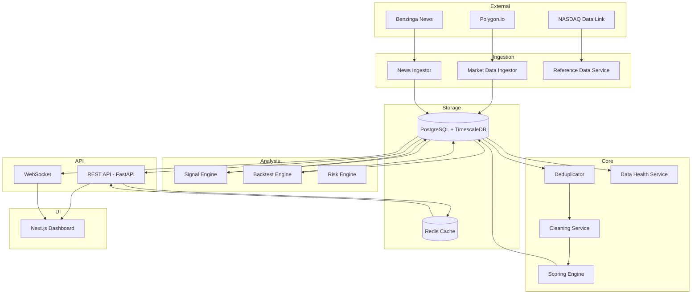
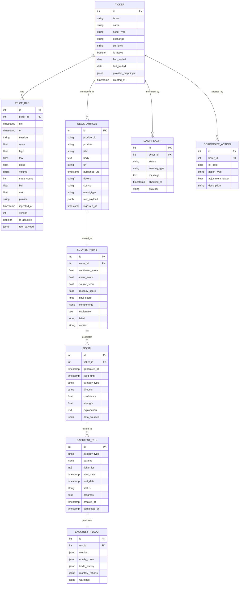

# Signal Desk — Architecture & Design

## 1. Requirements Restatement

### Business Goals
- Real-time US stock/ETF price monitoring (MU, VOO, SNDK initially)
- News ingestion with numerical scoring
- Historical backtesting with strict correctness
- Strategy analysis & signal generation
- Explainable, trustworthy results

### Technical Goals
- p95 API reads < 300ms cached, < 1500ms uncached
- WebSocket tick-to-UI < 1000ms
- Backtest preview < ~5s single-ticker
- Heavy backtests async with progress
- PostgreSQL + TimescaleDB for time-series
- Redis for caching & queues
- FastAPI backend + Next.js frontend

### Data Quality Risks
- Ticker changes & symbol reuse (SNDK delist risk)
- Session misclassification
- Corporate actions not reflected
- Future data leakage in backtests
- Delayed vs real-time feed confusion

### System Modules
1. Reference Data Service
2. Market Data Ingestion Service
3. News Ingestion Service
4. Deduplication / Cleaning Service
5. Scoring Engine
6. Signal Engine
7. Backtest Engine
8. Risk Engine
9. API Service
10. UI Application
11. Data Health Service
12. Scheduler / Worker Service

### Key Assumptions
- Polygon.io primary data provider (API key required)
- Benzinga primary news provider
- PostgreSQL 15+ with TimescaleDB
- Python 3.11+ / Node 18+
- Initial universe: MU, VOO, SNDK (with SNDK validation)

---

## 2. Architecture Diagram



---

## 3. Repository Structure

```
signal-desk/
├── backend/
│   ├── app/
│   │   ├── __init__.py
│   │   ├── main.py                  # FastAPI entry
│   │   ├── config.py                # Pydantic Settings
│   │   ├── database.py              # SQLAlchemy + TimescaleDB
│   │   ├── models/                  # SQLAlchemy ORM models
│   │   ├── schemas/                 # Pydantic schemas
│   │   ├── providers/              # Provider adapters
│   │   ├── services/               # Business logic
│   │   ├── api/                    # Route handlers
│   │   ├── ws/                     # WebSocket handlers
│   │   ├── workers/               # Background tasks
│   │   └── utils/                 # Helpers
│   ├── tests/
│   ├── alembic/
│   ├── requirements.txt
│   ├── Dockerfile
│   └── .env.example
├── frontend/
│   ├── src/
│   │   ├── app/                   # Next.js App Router
│   │   ├── components/
│   │   ├── lib/
│   │   └── styles/
│   ├── package.json
│   ├── Dockerfile
│   └── next.config.js
├── docker-compose.yml
└── README.md
```

---

## 4. Data Model (ER)



---

## 5. API Design

### REST Endpoints

```
GET    /api/v1/health                    # Service health
GET    /api/v1/tickers                   # List all tickers
GET    /api/v1/tickers/{ticker}          # Ticker details
GET    /api/v1/tickers/{ticker}/price    # Current price + health
GET    /api/v1/tickers/{ticker}/bars     # Historical bars
GET    /api/v1/tickers/{ticker}/news     # News articles
GET    /api/v1/tickers/{ticker}/signals  # Active signals
GET    /api/v1/tickers/{ticker}/health   # Data health status

GET    /api/v1/news                      # All scored news
GET    /api/v1/news/{id}                 # News detail + score

GET    /api/v1/signals                   # All signals
GET    /api/v1/signals/{id}              # Signal detail

GET    /api/v1/watchlist                 # Watchlist summary
POST   /api/v1/watchlist                 # Add ticker
DELETE /api/v1/watchlist/{ticker}        # Remove ticker

POST   /api/v1/backtest                  # Run backtest
GET    /api/v1/backtest/{id}             # Get results
GET    /api/v1/backtest/{id}/progress    # Poll progress

GET    /api/v1/strategies                # List available strategies
GET    /api/v1/strategies/{name}         # Strategy detail + params

GET    /api/v1/dashboard                 # Dashboard summary
GET    /api/v1/data-health               # All health warnings
```

### WebSocket Events

```
ticker:{ticker}:price     # Real-time price updates
ticker:{ticker}:news      # New scored news
ticker:{ticker}:signal    # New signal generated
backtest:{id}:progress    # Backtest progress
system:health             # System health updates
```

---

## 6. Phased Implementation Plan

### Phase 1 — Foundation (Days 1-2)
- Project scaffold, Docker, config
- Data models + migrations
- Provider abstraction interface
- PostgreSQL + TimescaleDB setup

### Phase 2 — Data Ingestion (Days 3-5)
- Polygon.io market data adapter (REST + WebSocket)
- Benzinga news adapter
- Deduplication & cleaning pipeline
- Data health checks
- Raw → cleaned data pipeline

### Phase 3 — Analysis Engine (Days 6-8)
- News scoring engine (lexicon + event + source + recency)
- Signal engine
- Backtest engine (strict)
- Strategy implementations (MA, Momentum, RSI, PEAD)
- Risk & metrics computation

### Phase 4 — API & UI (Days 9-12)
- FastAPI REST endpoints
- WebSocket support
- Next.js frontend (all pages)
- Dashboard, Watchlist, Analysis, News, Backtest, Health

### Phase 5 — Polish (Days 13-15)
- Tests (unit + integration)
- Seed data / fixtures
- Documentation
- Performance tuning
- Production hardening

---

## 7. Trade-offs Summary

| Dimension | Choice | Trade-off |
|-----------|--------|-----------|
| Time-series DB | TimescaleDB | More operational complexity than pure PG, but much better query perf |
| Cache | Redis | Another service to run, but sub-ms lookups |
| Frontend | Next.js | Heavier than plain React, but SSR + App Router benefits |
| Backtest engine | In-process Python | Not distributed, but simpler & avoids network latency |
| Provider primary | Polygon.io | Good API but rate-limited on free tier |
| Async workers | RQ (Redis) | Simpler than Celery, good enough for MVP |
| Containerization | Docker Compose | Not K8s, but fine for single-host deploys |
| News scoring | Lexicon-first | Less accurate than ML, but explainable & immediate |

---

## 8. Configurable Assumptions & Defaults

| Parameter | Default | Notes |
|-----------|---------|-------|
| Slippage regular | 0.001 (0.1%) | Configurable per session |
| Slippage extended | 0.003 (0.3%) | Higher for lower liquidity |
| Commission per trade | 0.0 | Set per broker if needed |
| Min data points | 252 | Min bars needed for backtest |
| Recency decay lambda | 0.1 | Exponential decay factor |
| News score bands | ±70, ±30 | Configurable thresholds |
| Cache TTL | 60s | Price data |
| Bar aggregation | 1 min | Default intraday bar |
| Max watchlist size | 50 | Soft limit |
